# CDMesh API Architecture

**Version**: 0.2.0-alpha
**Status**: Alpha
**Last Updated**: 2026-02-07

## Executive Summary

CDMesh API serves as the central contract definition for the Contract-Driven Mesh. It implements **Composable Mesh Architecture (CMA)**, providing a universal abstraction that unifies data products, microservices, event streams, and ML pipelines under a single governance framework.

The API utilizes **KCL (Kubernetes Configuration Language)** to define schemas and policies for the mesh topology, ensuring a **GitOps-managed, declarative source of truth** for all downstream systems (Graph Sync, AI Ops, platform adapters). This architecture builds upon contemporary data mesh research (Goedegebuure et al., 2023; van der Werf et al., 2025; Kumara et al., 2024) and extends it with novel governance patterns (Brambilla & Plebani, 2025) and automation capabilities (Wider et al., 2025).

### Key Value Propositions

- **2,500x Governance Efficiency**: O(D) policy propagation vs O(T) tuple-based systems (D ≈ 4, T ≈ 10,000)
- **Shift-Left Validation**: Compile-time governance verification prevents runtime policy violations
- **Universal Abstraction**: Single schema model for data products, microservices, event streams, and ML pipelines
- **Federated Governance**: Hierarchical policy cascading with domain-level autonomy
- **Knowledge Graph Ready**: RDF/OWL semantic integration for ontological reasoning

## Key Principles

### 1. Contract-First
API contracts are defined before implementation using executable schemas. KCL schemas serve as both documentation and validation logic, ensuring contracts are always synchronized with reality.

### 2. Declarative
Users define **"what"** the mesh looks like, not **"how"** to build it. The platform derives infrastructure, access controls, and monitoring from declarative contracts.

### 3. Versioned
Schemas and policies are version-controlled to ensure stability and traceability. All changes are tracked via Git with semantic versioning (X.Y.Z).

### 4. Language Agnostic
While defined in KCL, the contracts can be consumed by tools in any language (Rust, Go, Python, TypeScript). KCL compiles to JSON/YAML for platform adapters.

### 5. Composable Mesh Architecture (CMA)
Combines:
- **Data Mesh principles**: Domain Ownership, Data as a Product, Self-Serve Platform, Federated Governance
- **Domain-Driven Design patterns**: Aggregate Roots, Value Objects, Specification Objects, Bounded Contexts
- **Composability patterns**: Backstage, Crossplane, OAM, Terraform-inspired reusability

### 6. Semantic Driven Design (SDD)
KCL schemas serve as **executable ontologies** with RDF/OWL integration. Entities are annotated with semantic metadata for knowledge graph construction and ontological reasoning.

### 7. Contract Driven Infrastructure (CDI)
Infrastructure is derived from contracts with **federated inheritance** and **O(D) complexity**. Policy updates propagate via schema inheritance, eliminating tuple-level governance overhead.

### 8. Contract Driven Lifecycle (CDL)
**Compile-time governance verification** with shift-left validation. Policy violations are caught during `kcl run`, not in production.

## Domain Model

### Architecture Overview


### Base Schema: MeshNode

**MeshNode** is the universal base schema for all catalog-managed entities in CMA. It represents autonomous units with:

- **Independent lifecycle** (version, status fields)
- **Independent identity** (globally unique id)
- **Governance policies** (cascaded from parent)
- **Semantic metadata** (for knowledge graphs)
- **Deployment specifications** (for infrastructure)

**DDD Pattern**: Aggregate Root

**File**: `core/node.k`

**Key Attributes**:
- `id` (globally unique identifier)
- `name` (human-readable name)
- `description` (purpose and scope)
- `semantics` (SemanticMetadata for RDF integration)
- `policies` (governance policies, cascaded from parent)
- `constraints` (compile-time validation constraints)
- `deployment` (DeploymentSpec for GitOps)
- `version` (semantic versioning X.Y.Z)
- `status` (proposed | experimental | live | deprecated | retired)
- `owner` (responsible team or individual)
- `tags` (trigger policy mixins like PII, GDPR, PCI-DSS, SOC2)

### 6-Level Hierarchy


#### Level 0: Organization

**Description**: Top-level governance boundary in the mesh hierarchy. Enables multi-tenancy, global policy cascading, and regulatory compliance.

**File**: `discovery/organization.k`

**DDD Pattern**: Aggregate Root (outermost Bounded Context)

**CMA Principle**: Global governance with O(D) policy propagation

**Key Attributes**:
- `legalName` (legal registered name)
- `jurisdiction` (ISO 3166-1 alpha-2 country code: US, GB, DE, etc.)
- `regulatoryFramework` (GDPR, CCPA, HIPAA, PCI-DSS, SOC2, etc.)
- `billingAccountId` (cloud provider billing account)
- `costCenter` (internal cost allocation)

**Relationships**:
- CONTAINS → Mesh (one-to-many)

#### Level 1: Mesh

**Description**: Organizational or tenant boundary within an Organization. Represents a business unit, product line, or isolated tenant space.

**File**: `discovery/mesh.k`

**DDD Pattern**: Aggregate Root (Bounded Context)

**Data Mesh Principle**: Defines the scope of the data ecosystem

**Key Attributes**:
- `organizationId` (reference to parent Organization)

**Relationships**:
- CONTAINED_BY → Organization (many-to-one)
- CONTAINS → Domain (one-to-many)

#### Level 2: Domain

**Description**: Business capability boundary that owns and manages related products. Implements **domain ownership** principle from Data Mesh.

**File**: `discovery/domain.k`

**DDD Pattern**: Aggregate Root (Bounded Context)

**Data Mesh Principle**: Domain Ownership

**Key Attributes**:
- `meshId` (reference to parent Mesh)

**Relationships**:
- CONTAINED_BY → Mesh (many-to-one)
- OWNS → Product (one-to-many)

#### Level 3: Product

**Description**: Autonomous, deployable unit treating resources as first-class products. Can be **atomic** (single-component) or **composite** (multi-component). Implements **Data as a Product** principle from Data Mesh.

**File**: `discovery/product.k`

**DDD Pattern**: Aggregate Root

**Data Mesh Principle**: Data as a Product

**Key Attributes**:
- `domainId` (reference to parent Domain)
- `kind` (dataset | api | stream | dashboard | algorithm | service)
- `components` (list of Component IDs for composition)
- `componentGraph` (ComponentEdge list for data flow wiring)
- `ports` (product-level external ports)
- `dependsOn` (list of product dependencies)

**Composition Patterns**:
- **Atomic**: Single-component or legacy products (`components = []` or `None`)
- **Composite**: Multi-component products with explicit wiring (`components` + `componentGraph`)

**Relationships**:
- OWNED_BY → Domain (many-to-one)
- COMPOSES → Component (one-to-many)
- EXPOSES → Port (one-to-many, product-level external ports)
- DEPENDS_ON → Product (many-to-many)

#### Level 4: Component

**Description**: Atomic, reusable building block for product compositions. Smallest deployable quantum that can be combined into complex products. Supports **template + instance pattern** for reusability.

**File**: `discovery/component.k`

**DDD Pattern**: Aggregate Root (independent lifecycle)

**CMA Principle**: Component reusability and composition

**Industry Alignment**:
- Backstage Component
- Crossplane Composition
- Open Application Model (OAM)
- Terraform Modules

**Key Attributes**:
- `productId` (reference to parent Product for instances)
- `kind` (ingestion | transformation | aggregation | serving | orchestration | service | infrastructure)
- `ports` (component-owned internal ports)
- `dependsOn` (list of component dependencies)
- `template` (reference to template Component ID, or None if this IS a template)
- `reusable` (whether component can be shared across products)
- `runtime` (databricks | kubernetes | airflow | dbt | spark | flink | custom)
- `config` (component-specific configuration parameters)

**Usage Patterns**:
- **Template**: Reusable component definition in catalog (`template = None`, `reusable = true`)
- **Instance**: Configured component from template (`template = component-id`, `productId = product-id`)

**Relationships**:
- COMPOSED_BY → Product (many-to-one)
- EXPOSES → Port (one-to-many, component-level ports)
- DEPENDS_ON → Component (many-to-many)
- INSTANTIATES → Component (template-instance relationship)

#### Level 5: Port

**Description**: Polymorphic interface boundary defining how data/services/events flow. Can be owned by **Components** (internal wiring) or **Products** (external interfaces).

**File**: `discovery/port.k`

**DDD Pattern**: Value Object (no independent identity, immutable)

**Data Mesh Principle**: Self-Serve Data Platform through standardized interfaces

**CMA Principle**: Unified interface abstraction for heterogeneous resources

**Key Attributes**:
- `name`
- `description`
- `direction` (input | output | bidirectional)
- `componentId` (optional, for component-owned ports)
- `portType` (data | service | event - discriminator field)
- `classification` (public | internal | confidential | restricted)
- `sla` (SLA metrics dictionary)

**Port Types**:

| Type | Description | Required Fields | Optional Fields |
|------|-------------|-----------------|-----------------|
| **data** | Datasets, files, tables | `format` | `schema`, `catalog` |
| **service** | REST/gRPC/GraphQL APIs | `protocol` | `openApiSpec`, `authentication` |
| **event** | Kafka/Kinesis/MQTT streams | `topic` | `eventSchema`, `messageFormat` |

**Ownership Model**:
- **Component Ports**: Internal interfaces for component wiring (`componentId` set)
- **Product Ports**: External interfaces for consumer access (`componentId = None`)

**Relationships**:
- EXPOSED_BY → Component (many-to-one, internal ports)
- EXPOSED_BY → Product (many-to-one, external ports)

### Component Graph: Explicit Wiring

**ComponentEdge** enables explicit data flow between components in composite products.

**File**: `discovery/edge.k`

**DDD Pattern**: Value Object (immutable descriptor)

**CMA Principle**: Explicit component wiring for composition

**Key Attributes**:
- `sourceComponent` (source component ID)
- `sourcePort` (output port name on source)
- `targetComponent` (target component ID)
- `targetPort` (input port name on target)
- `transformation` (optional data transformation expression)
- `metadata` (edge metadata for SLAs, lineage, quality rules)

**Graph Properties**:
- **Directed**: sourceComponent → targetComponent
- **Acyclic**: No circular dependencies (DAG required)
- **Port-specific**: Connects specific ports, not just components

**Validation**:
- No self-referential edges (`sourceComponent != targetComponent`)
- Must form Directed Acyclic Graph (future: cycle detection)


### Specifications and Value Objects

#### DeploymentSpec

**Description**: Operational context and source configuration for a MeshNode.

**File**: `deploy/spec.k`

**DDD Pattern**: Specification Object (part of MeshNode aggregate)

**Data Mesh Principle**: Self-Serve Platform through declarative deployment

**Key Attributes**:
- `environment` (deployment target: production, staging, development)
- `source` (SourceRepository for GitOps)
- `region` (optional cloud region)
- `encryption` (optional EncryptionConfig)
- `accessLogging` (optional access logging config)

#### SourceRepository

**Description**: Git repository location and access configuration.

**File**: `deploy/repository.k`

**DDD Pattern**: Value Object (immutable descriptor)

**Key Attributes**:
- `url` (Git repository URL, required)
- `branch` (Git branch, optional)
- `tag` (Git tag, optional)
- `path` (path within repository, optional)
- `sshHostFingerprint` (SSH host fingerprint, optional)
- `sshPrivateKey` (SSH private key reference, optional)

### Governance Model

#### Policy

**Description**: Governance policy with constraints for compile-time validation.

**File**: `governance/policy.k`

**DDD Pattern**: Specification Object

**CMA Principle**: Contract Driven Lifecycle (CDL) - shift-left governance

**Key Attributes**:
- `id` (policy identifier)
- `name` (human-readable policy name)
- `scope` (organization | mesh | domain | product | component)
- `policyType` (security | compliance | quality | cost | operational)
- `enforcement` (blocking | warning | advisory)
- `constraints` (list of Constraint objects)
- `tags` (tags that trigger this policy)

#### Constraint

**Description**: Compile-time validation constraint within a Policy.

**File**: `governance/policy.k`

**DDD Pattern**: Specification Object

**Key Attributes**:
- `expression` (constraint expression in KCL syntax)
- `message` (human-readable error message)
- `severity` (error | warning | info)

#### Policy Mixins

Reusable policy patterns defined in `governance/mixins.k`. These mixins implement tag-triggered policy activation, enabling automated compliance checking as explored in Wider et al. (2025)'s work on AI-assisted data governance:

| Mixin | Triggered By | Compliance | Constraints |
|-------|--------------|------------|-------------|
| **PIIMixin** | `["PII"]` | GDPR Article 5, CCPA Section 1798.100 | Encryption at rest, access logging, data masking |
| **GDPRMixin** | `["GDPR"]` | GDPR Articles 5, 17, 20 | Retention limits, erasure capability, data portability |
| **PCIDSSMixin** | `["PCI-DSS"]` | PCI-DSS Requirements 3, 4, 7, 11 | Cardholder data encryption, network segmentation, vulnerability scans |
| **SOC2Mixin** | `["SOC2"]` | SOC 2 Trust Service Criteria | System monitoring, change management, incident response |

### Semantic Metadata

**Description**: Semantic annotations for knowledge graph integration.

**File**: `semantics/ontology.k`

**DDD Pattern**: Value Object

**CMA Principle**: Semantic Driven Design (SDD) - executable ontologies

**Key Attributes**:
- `rdfType` (RDF class URI, e.g., "http://schema.org/Dataset")
- `namespace` (URI prefix for identifiers)
- `businessGlossaryTerms` (human-readable domain concepts)
- `dataClassification` (public | internal | confidential | restricted)
- `upstreamDependencies` (data lineage sources)
- `downstreamConsumers` (data lineage consumers)

**Standards**:
- DCAT 2.0 (W3C Data Catalog Vocabulary)
- Schema.org (structured data vocabulary)
- SKOS (Simple Knowledge Organization System)

## Hierarchy & Policy Cascading

### Policy Propagation Model

CDMesh API implements **federated policy cascading** with O(D) complexity, inspired by the scalable policy-as-code architecture proposed by Brambilla & Plebani (2025) for data products. Their work on Policy Decision Points (PDPs) and Policy Enforcement Points (PEPs) informs our compile-time validation approach, where policies are distributed hierarchically rather than evaluated centrally at runtime.

```mermaid
graph TD
    subgraph "Policy Inheritance Hierarchy"
        OrgPolicy[Organization Policies<br/>C_Organization]
        MeshPolicy[Mesh Policies<br/>C_Mesh = C_Org ⊕ C_Local_Mesh]
        DomainPolicy[Domain Policies<br/>C_Domain = C_Mesh ⊕ C_Local_Domain]
        ProductPolicy[Product Policies<br/>C_Product = C_Domain ⊕ C_Local_Product]
        ComponentValidation[Component<br/>Validates against C_Product]
        PortValidation[Port<br/>Validates against C_Product/Component]
    end

    OrgPolicy -->|Cascades| MeshPolicy
    MeshPolicy -->|Cascades| DomainPolicy
    DomainPolicy -->|Cascades| ProductPolicy
    ProductPolicy -->|Validates| ComponentValidation
    ComponentValidation -->|Validates| PortValidation

    style OrgPolicy fill:#E74C3C,stroke:#C0392B,color:#fff
    style MeshPolicy fill:#3498DB,stroke:#2980B9,color:#fff
    style DomainPolicy fill:#9B59B6,stroke:#8E44AD,color:#fff
    style ProductPolicy fill:#1ABC9C,stroke:#16A085,color:#fff
    style ComponentValidation fill:#F39C12,stroke:#D68910,color:#fff
    style PortValidation fill:#ECF0F1,stroke:#95A5A6,color:#000
```



### Policy Cascading Formula

```
C_final(Node) = C_Organization ⊕ C_Mesh ⊕ C_Domain ⊕ C_Product ⊕ C_Local

Where ⊕ represents policy composition (union with child precedence)
```

### Complexity Analysis

**Federated Inheritance (CDMesh API)**:
- Complexity: **O(D)** where D = hierarchy depth ≈ 4
- Single policy update at Organization level propagates to all child nodes with O(D) recompilation cost

**Tuple-Based Governance (Traditional)**:
- Complexity: **O(T)** where T = table count ≈ 10,000
- Policy update requires updating every table row individually

**Benefit**: **2,500x reduction in governance overhead** (10,000 / 4 = 2,500)

### Constraint Propagation (Taint Analysis)

**Theorem 1 (Constraint Propagation)**:
If Node A has property P (ContainsPII) and Node C consumes Node A, then Node C must satisfy constraint Requires(P) (HasEncryption). Validated at compile-time via check blocks.

**Example**:
If Product A has tag `"PII"` and Product C depends on Product A, then Product C must inherit tag `"PII"` and satisfy PII constraints (encryption at rest, access logging, etc.).

## CMA Pillars

### Pillar 1: Semantic Driven Design (SDD)

**Description**: KCL schemas as executable ontologies

**Implementation**: `semantics/ontology.k` (SemanticMetadata with RDF types)

**Status**: ✅ Complete

**Key Concepts**:
- Schemas are not just validation logic but also semantic definitions
- RDF/OWL integration enables ontological reasoning
- Business glossary terms map to domain concepts
- Data classification enables automated access control

### Pillar 2: Contract Driven Infrastructure (CDI)

**Description**: Infrastructure derived from contracts with federated inheritance

**Implementation**: `governance/mixins.k` (O(D) policy cascading)

**Status**: ✅ Complete

**Key Concepts**:
- Infrastructure is generated from declarative contracts, not manually configured
- Policy cascading achieves O(D) complexity vs O(T) tuple-based systems (Brambilla & Plebani, 2025)
- Federated governance enables domain autonomy with global compliance (Dolhopolov et al., 2024)
- Practical implementation patterns validated in production environments (Kumara et al., 2024)

### Pillar 3: Contract Driven Lifecycle (CDL)

**Description**: Compile-time governance verification with shift-left validation

**Implementation**: `governance/policy.k` (Constraint propagation)

**Status**: ✅ Complete

**Key Concepts**:
- Policy violations caught during `kcl run`, not in production
- Constraint propagation via taint analysis (tag inheritance)
- Compile-time validation eliminates runtime governance overhead
- Shift-left governance reduces manual policy evaluation workload (Wider et al., 2025)

## Structure & Organization

```
cdmesh-api/
├── core/
│   └── node.k                 # MeshNode base schema
│
├── governance/
│   ├── policy.k               # Policy and Constraint schemas
│   └── mixins.k               # PIIMixin, GDPRMixin, PCIDSSMixin, SOC2Mixin
│
├── semantics/
│   └── ontology.k             # SemanticMetadata
│
├── discovery/
│   ├── organization.k         # Level 0: Organization
│   ├── mesh.k                 # Level 1: Mesh
│   ├── domain.k               # Level 2: Domain
│   ├── product.k              # Level 3: Product
│   ├── component.k            # Level 4: Component
│   ├── edge.k                 # ComponentEdge for data flow
│   └── port.k                 # Level 5: Port
│
├── deploy/
│   ├── spec.k                 # DeploymentSpec
│   └── repository.k           # SourceRepository
│
├── examples/
│   ├── databricks_etl_composite.k      # Bronze→Silver→Gold ETL
│   └── microservices_composite.k       # Microservices API platform
│
└── docs/
    ├── architecture.md        # This file
    ├── cdmesh-api.md          # Generated API reference
    └── schemas/
        ├── core.md
        ├── discovery.md
        ├── governance.md
        ├── deploy.md
        └── semantics.md
```

### Planned Directories

| Directory | Status | Phase | Description |
|-----------|--------|-------|-------------|
| `access/` | Planned | Phase 7 | Access control schemas (ReBAC, XACML) |
| `adapters/` | Planned | Phases 4-5 | Platform adapters (Kubernetes, ODCS, Databricks) |
| `lineage/` | Planned | Priority 3 | Data lineage schemas (OpenLineage, W3C PROV) |
| `ontology/` | Planned | Phase 6 | Relationship schemas (IS_A, PART_OF, DERIVES_FROM) |
| `quality/` | Planned | Priority 2 | Data quality metrics (DAMA DMBOK) |

## Technology Stack

**Language**: KCL (Kubernetes Configuration Language) v0.11.2

**Module**:
- Name: `cdmesh-api`
- Version: `0.2.0-alpha`
- Registry: `oci://ghcr.io/<owner>/cdmesh-api`

**Tooling**:
- `kcl-cli` - Validation, testing, compilation
- `kcl-language-server` - IDE support (VS Code, IntelliJ)
- `kcl-fmt` - Code formatting
- `kcl-lint` - Static analysis
- `kcl-vet` - Validation tool

## Implementation Status

| Phase | Name | Status | Description |
|-------|------|--------|-------------|
| 1 | Foundation | ✅ Complete | MeshNode, governance, semantics |
| 2 | Hierarchy Enhancement | ✅ Complete | 6-level hierarchy with Organization and Component layers |
| 3 | Case Study | 📋 Planned | Kart Recommendation System with PII constraint propagation (following Kumara et al. 2024 case study methodology) |
| 4 | Kubernetes Adapter | 📋 Planned | Product/Component → K8s Deployment/Service transpiler |
| 5 | ODCS Integration | 📋 Planned | Bidirectional ODCS adapter for industry standard compatibility |
| 6 | Semantic Layer | 📋 Planned | Relationship schemas (IS_A, PART_OF, DERIVES_FROM) |
| 7 | Access Control | 📋 Planned | ReBAC access policies and domain ownership |
| 8 | Documentation & Release | 🚧 In Progress | Comprehensive documentation and v0.2.0-alpha release |

## Standards Compliance

### Privacy & Compliance ✅

| Standard | Status | Implementation |
|----------|--------|----------------|
| GDPR | Complete | `governance/mixins.k` (GDPRMixin) |
| CCPA | Complete | `governance/mixins.k` (PIIMixin) |
| PCI-DSS | Complete | `governance/mixins.k` (PCIDSSMixin) |
| SOC 2 | Complete | `governance/mixins.k` (SOC2Mixin) |

### Data Catalogs & Semantics 🚧

| Standard | Status | Implementation |
|----------|--------|----------------|
| DCAT 2.0 | In Progress | `semantics/ontology.k` (SemanticMetadata) |

### Component Models ✅

| Standard | Status | Implementation |
|----------|--------|----------------|
| Backstage Component | Aligned | `discovery/component.k` |
| Crossplane Composition | Aligned | Product composition pattern |
| Open Application Model (OAM) | Aligned | Component + configuration |
| Terraform Modules | Aligned | Template + instance pattern |

### Planned Standards 📋

| Standard | Status | Phase/Priority | Description |
|----------|--------|----------------|-------------|
| ODCS v3.1.0 | Planned | Phase 5 | Open Data Contract Standard |
| OpenLineage | Planned | Priority 3 | Data lineage tracking |
| W3C PROV | Planned | Priority 3 | Provenance vocabulary |
| XACML | Planned | Phase 7 | Extensible Access Control Markup Language |
| ReBAC | Planned | Phase 7 | Relationship-Based Access Control |
| Kubernetes | Planned | Phase 4 | K8s adapter for orchestration |

## Validation & Testing

### Compilation Validation ✅
- All schemas compile successfully with `kcl run`
- No circular dependencies
- All imports resolve correctly

### Schema Validation ✅
- MeshNode hierarchy validates correctly
- Polymorphic ports validate per port type
- Policy cascading structure valid
- Component composition validates componentGraph
- Template/instance pattern validates

### Academic Validation ✅
- Three pillars of CMA implemented (SDD, CDI, CDL)
- Constraint propagation theorem validated
- Complexity reduction theorem demonstrated (2,500x improvement)

### Examples ✅
- `databricks_etl_composite.k` compiles successfully
- `microservices_composite.k` compiles successfully

## Academic References

### Foundational Papers

1. **Goedegebuure et al. (2023)**: "Data Mesh: a Systematic Gray Literature Review" - *ACM Computing Surveys*
   - Systematic review of data mesh literature, establishing core principles and patterns
2. **van der Werf et al. (2025)**: "Towards a Data Mesh Reference Architecture" - *Springer LNBIP*
   - Proposes comprehensive reference architecture for data mesh implementations
3. **Kumara et al. (2024)**: "Data Mesh Architecture: From Theory to Practice" - *ICSA 2024 (IEEE)*
   - Tutorial covering practical implementation of data mesh with case studies from Netherlands and Germany
4. **Dolhopolov et al. (2024)**: "Implementing Federated Governance in Data Mesh Architecture" - *MDPI Future Internet*
   - Addresses federated governance patterns and implementation strategies
5. **Brambilla & Plebani (2025)**: "Scalable Policy-as-Code Decision Points for Data Products" - *ICWS 2025 (IEEE)*
   - Introduces scalable PDP/PEP architecture for policy-as-code in data mesh, addressing policy distribution and consistency
6. **Pingos et al. (2024)**: "Transforming Data Lakes to Data Meshes Using Semantic Data Blueprints" - *ENASE 2024*
   - Demonstrates semantic blueprints for data lake to data mesh transformation
7. **Hogan et al. (2021)**: "Knowledge Graphs" - *ACM Computing Surveys*
   - Comprehensive survey of knowledge graph technologies and ontological reasoning
8. **Wider et al. (2025)**: "AI-Assisted Data Governance with Data Mesh Manager" - *ICWS 2025 (IEEE)*
   - Explores LLM-based automation for data governance compliance checking and policy evaluation

### Design Patterns

1. **Evans (2003)**: "Domain-Driven Design" - Aggregate Root, Value Object, Specification Object
2. **Gang of Four (1994)**: "Design Patterns: Elements of Reusable Object-Oriented Software" - Composite, Template Method, Strategy

---

**Next**: [Core Schemas Documentation](schemas/core.md) | [Discovery Schemas Documentation](schemas/discovery.md)
